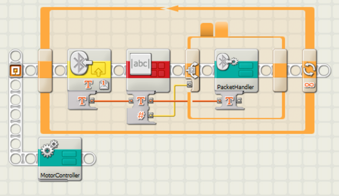
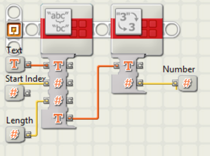
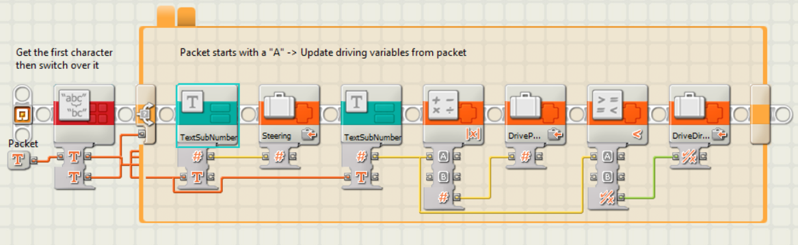
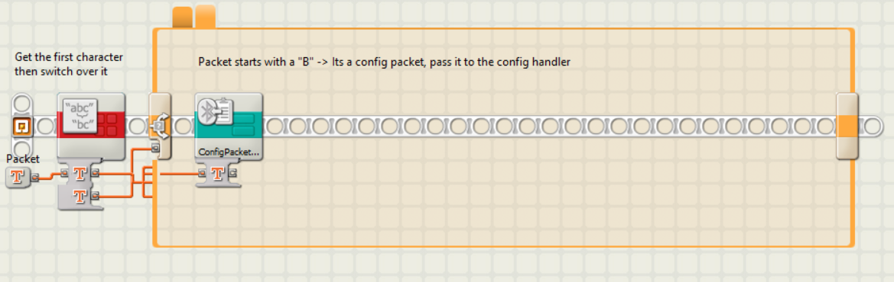
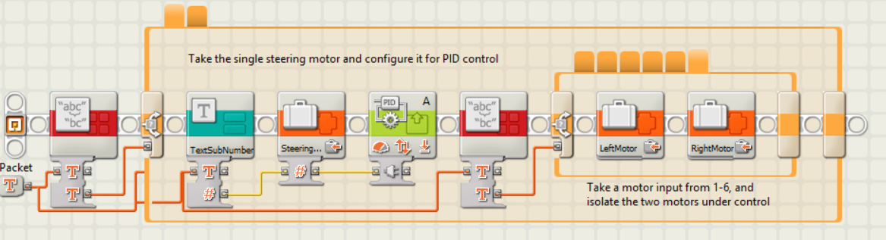
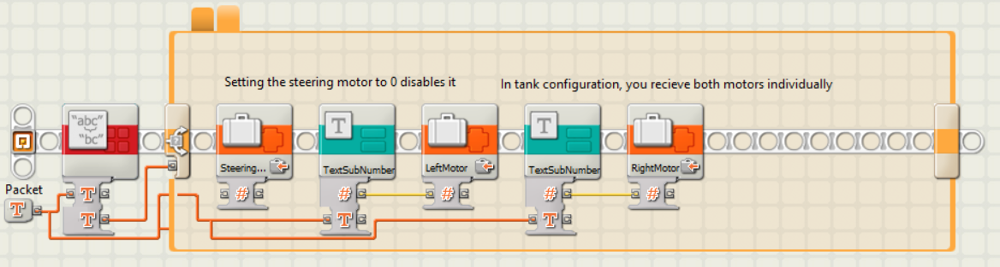
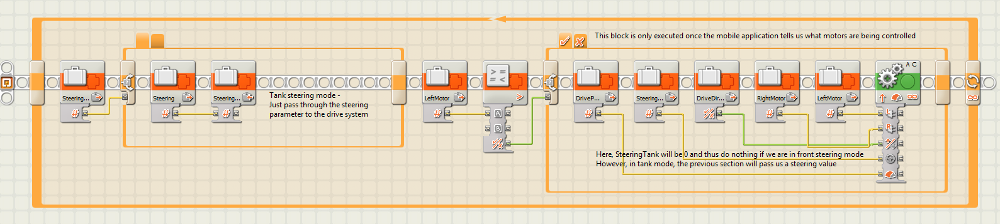

# Lego NXT Client Application
This program required a client application to be written and compiled for the Lego Mindstorms NXT Device. 
This file outlines the client application and how it works, and how it is used by the mobile application.

# Steering Types
There are two supported steering types, `tank` and `front wheel steering`. 
Tank controls control the left and right channels with different amounts of power to control steering,
while Front Wheel uses a motor to turn the front wheels left or right, and then one or two motors to drive.
 
# Protocol Information
This program allows the application to send basic commands for controlling motors.
It offers a configurable interface that allows the mobile application to write its
configuration, and then not need to worry about managing the motors at all, only sending
the direction and power of the drive motors, and the steering. 

Packets are sent as ASCII strings, as this is the easiest type of data to process on the NXT device.

## Drive packet structure
All steering configurations use the same packet structure to control the motors, and the client application handles translating 
this information to the motor control. A is used to denote a motor control packet.
Note that the diagram below shows how many bits a specific variable is, aka the 'A' character is 8 bits long.
```
 0                   1                   2                   3          
 0 1 2 3 4 5 6 7 8 9 0 1 2 3 4 5 6 7 8 9 0 1 2 3 4 5 6 7 8 9 0 1 2 3 4 5
+-+-+-+-+-+-+-+-+-+-+-+-+-+-+-+-+-+-+-+-+-+-+-+-+-+-+-+-+-+-+-+-+-+-+-+-+
|       A       |                     Steering Angle                    |
+-+-+-+-+-+-+-+-+-+-+-+-+-+-+-+-+-+-+-+-+-+-+-+-+-+-+-+-+-+-+-+-+-+-+-+-+
|       |                             Power                             |
+-+-+-+-+-+-+-+-+-+-+-+-+-+-+-+-+-+-+-+-+-+-+-+-+-+-+-+-+-+-+-+-+-+-+-+-+
```
The Steering angle controls either the angle of the front motor when in front steering mode, or adjusts the power going to the left and right motors in tank mode.

## Configuration packet structure
The basic configuration packet structure is outlined below, where each variable is an ASCII character.
B is used to denote a configuration packet.
```
 0                   1                   2                   3  
 0 1 2 3 4 5 6 7 8 9 0 1 2 3 4 5 6 7 8 9 0 1 2 3 4 5 6 7 8 9 0 1
+-+-+-+-+-+-+-+-+-+-+-+-+-+-+-+-+-+-+-+-+-+-+-+-+-+-+-+-+-+-+-+-+
|       B       |  SteeringType |   FirstMotor  | SecondMotor(s)|
+-+-+-+-+-+-+-+-+-+-+-+-+-+-+-+-+-+-+-+-+-+-+-+-+-+-+-+-+-+-+-+-+
```
SteeringType = 0 for front steering, or 1 for tank steering
## Motor serialization
| Output Port | ASCII value |
|-------------|-------------|
| A           | 1           |
| B           | 2           |
| C           | 3           |
| A + B       | 4           |
| A + C       | 5           |
| B + C       | 6           |

Note that single motor values only accept 1-3, while multiple motor values accept 1-6

## Front Steering
For front steering, the packet looks like the below diagram:
```
 0                   1                   2                   3  
 0 1 2 3 4 5 6 7 8 9 0 1 2 3 4 5 6 7 8 9 0 1 2 3 4 5 6 7 8 9 0 1
+-+-+-+-+-+-+-+-+-+-+-+-+-+-+-+-+-+-+-+-+-+-+-+-+-+-+-+-+-+-+-+-+
|       B       |       0       | SteeringMotor | DriveMotor(s) |
+-+-+-+-+-+-+-+-+-+-+-+-+-+-+-+-+-+-+-+-+-+-+-+-+-+-+-+-+-+-+-+-+
```
- Steering Motor: Single Motor (1-3)
- Drive Motor(s): One or Two Motors (1-6)

## Tank Steering
For tank steering, the packet looks like the below diagram:
```
 0                   1                   2                   3  
 0 1 2 3 4 5 6 7 8 9 0 1 2 3 4 5 6 7 8 9 0 1 2 3 4 5 6 7 8 9 0 1
+-+-+-+-+-+-+-+-+-+-+-+-+-+-+-+-+-+-+-+-+-+-+-+-+-+-+-+-+-+-+-+-+
|       B       |       1       |   LeftMotor   |   RightMotor  |
+-+-+-+-+-+-+-+-+-+-+-+-+-+-+-+-+-+-+-+-+-+-+-+-+-+-+-+-+-+-+-+-+
```

## Application information
The application is developed using the NXT-G application, and is provided under `NXT Program/Default/SteeringControl.rbt`. However, the profile is provided as it makes extensive use of `My Blocks/Sub Modules`. Note that there are also a lot of custom blocks provided as well that will need to be installed for the project to function.

#### Main Program
The project starts in the main program. . 

This program splits into two tasks, one that handles reading packets from bluetooth, and the other which handles controling the motors, and the two modules communicate through variables. The bluetooth handling task reads an ASCII packet, and then checks that the length of the packet is greater than 0, and if so, it passes it to the packet handler to be processed. The second task just calls the motor controller.
#### TextSubNumber Block


A utility routine called `TextSubNumber` takes the packet and a start index and length, and then reads that section from the packet and converts it to a number, sending it back to the caller routine.
#### PacketHandler Block


The packet handler has two states, which are decided based on the first character of the packet. If the first character is an A, we take the next four characters and convert them to a number, and write that to the `Steering` variable. We then take the four after than, and write that to a `DrivePower` variable. However, we need the direction to be seperate to the power, so we take the absolute value of the power and write that to a variable called DrivePower, and if it is < 0 we write true to DriveDirection, otherwise we write a false.
#### PacketHandlerConfig Block


In the case that the first character is a B, we pass it directly to the `ConfigPacketHandler`.



The configuration packet has two states, dependant on if the second character of the packet is a 1 or a 0. If it is a 0, we then read the next character as a digit and treat it as a single motor, writing it into a variable called `SteeringPort`. We also configure that motor for PID control, telling it to work out its limits and recenter. We then read the next character, and using the output port table above in reverse, we map it to a `LeftMotor` and a `RightMotor`, writing a 0 to the `RightMotor` in single motor configurations.



When we are in tank mode, we do not have a `SteeringPort`, so we write a 0 to that variable. we then take the third character, and write it directly to the LeftMotor variable, treating it as a single motor. We then read the next character and do the same thing, but to the `RightMotor` variable.
#### MotorController Block


In the motor control subroutine, control flow is passed to this routine. It begins by reading the `SteeringPort` variable, and if it is not a 0, it then writes the current `Steering` variable to the angle of a PID controller, targeting the motor stored in `SteeringPort`. It then writes a 0 to `SteeringTank`, as we do not want the tank controls to be affected by the `Steering` variable.

We then check if the `LeftMotor` variable is greater than 0. We do this as a sanity check, as an unconfigured application would result in all outputs being 0, and as there is no motor 0, the program would crash. We then write `DrivePower`, `SteeringTank`, `DriveDirection` `RightMotor` and `LeftMotor` to the defined right and left motors, and in this mode, a steering value of 0 leaves both motors syncronized with eachother.



In the case of tank controls, we just pass the `Steering` variable to `SteeringTank`, and then we repeat the above process, however this time there is a steering value provided to the driving motors, and so they will have the power delivered to each motor adjusted based on the angle of the `Steering` variable.
