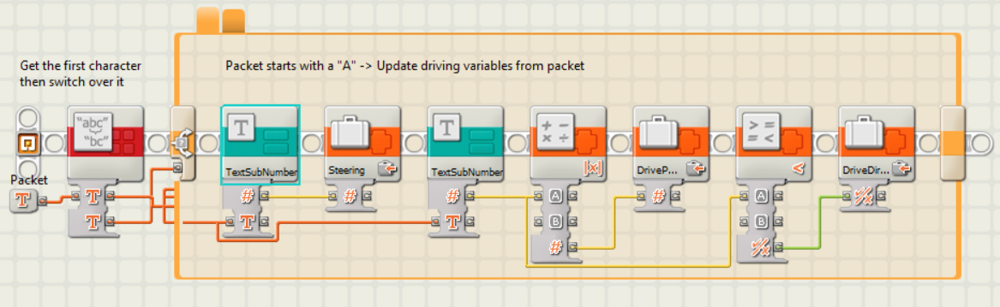

<h1 style="display:inline;">SWEN 325 Assignment 1 - NXToolKit</h1><span style="float:right">Sanjay Govind - 300383656</span>


# 1. External Component
My external component for this project is a Lego Mindstorms NXT robot. 
The LEGO Mindstorms NXT provides the ability for a user to connect over bluetooth, and using a serial based protocol, retrieve and send data to the device. It provides multiple sensors and 3 motors, and I build a remote controlled kart to control as my external device. 

The NXT provides multiple layers for development, as I also required the use of a client application that ran on the device in order to gain more control over the device.

## 1.1. Packets
The NXT uses a packet structure to communicate with an application. 
I found the `Mindstorms Bluetooth Developer Kit` documentation, and used it as a basis to develop an API that allowed me to easily use the packet structure from typescript. This packet structure uses raw bytes to send data between the NXT and the phone, and I found a bluetooth serial API that gave me a subscription that would let me receive bytes from the device and send bytes. I then read bytes into a buffer until a complete packet is retrieved, and parse each packet using a lookup table.

I implemented each packet individually and have them all inherit from a base `Packet` class. This class has functions for serializing and deserializing each packet to its raw byte structure, which allows each packet to handle being both read and written to a byte stream. I then store each packet in a lookup table to its ID, which allows me to quickly construct a packet when data is received from the device.

An event based system was required to allow multiple pages and components to selectivly receive decoded packets from the NXT device. I used a RxJS subject for this task, and then any components that require a packet can subscribe to this subject, and apply a fliter to only listen to useful packets.

## 1.2. Client Application
This program required a client application to be written and compiled for the Lego Mindstorms NXT Device. 
This file outlines the client application and how it works, and how it is used by the mobile application. As a part of writing this application, i developed my own protocol for sending data, and the application implements this protocol inside `motor.ts`.

### 1.2.1. Steering Types
There are two supported steering types, `tank` and `front wheel steering`. 
Tank controls control the left and right channels with different amounts of power to control steering,
while Front Wheel uses a motor to turn the front wheels left or right, and then one or two motors to drive.
 
### 1.2.2. Protocol Information
This program allows the application to send basic commands for controlling motors.
It offers a configurable interface that allows the mobile application to write its
configuration, and then not need to worry about managing the motors at all, only sending
the direction and power of the drive motors, and the steering. 

Packets are sent as ASCII strings, as this is the easiest type of data to process on the NXT device.

### 1.2.3. Drive packet structure
All steering configurations use the same packet structure to control the motors, and the client application handles translating 
this information to the motor control. A is used to denote a motor control packet.
Note that the diagram below shows how many bits a specific variable is, aka the 'A' character is 8 bits long.
```
 0                   1                   2                   3          
 0 1 2 3 4 5 6 7 8 9 0 1 2 3 4 5 6 7 8 9 0 1 2 3 4 5 6 7 8 9 0 1 2 3 4 5
+-+-+-+-+-+-+-+-+-+-+-+-+-+-+-+-+-+-+-+-+-+-+-+-+-+-+-+-+-+-+-+-+-+-+-+-+
|       A       |                     Steering Angle                    |
+-+-+-+-+-+-+-+-+-+-+-+-+-+-+-+-+-+-+-+-+-+-+-+-+-+-+-+-+-+-+-+-+-+-+-+-+
|       |                             Power                             |
+-+-+-+-+-+-+-+-+-+-+-+-+-+-+-+-+-+-+-+-+-+-+-+-+-+-+-+-+-+-+-+-+-+-+-+-+
```
The Steering angle controls either the angle of the front motor when in front steering mode, or adjusts the power going to the left and right motors in tank mode.

### 1.2.4. Configuration packet structure
The basic configuration packet structure is outlined below, where each variable is an ASCII character.
B is used to denote a configuration packet.
```
 0                   1                   2                   3  
 0 1 2 3 4 5 6 7 8 9 0 1 2 3 4 5 6 7 8 9 0 1 2 3 4 5 6 7 8 9 0 1
+-+-+-+-+-+-+-+-+-+-+-+-+-+-+-+-+-+-+-+-+-+-+-+-+-+-+-+-+-+-+-+-+
|       B       |  SteeringType |   FirstMotor  | SecondMotor(s)|
+-+-+-+-+-+-+-+-+-+-+-+-+-+-+-+-+-+-+-+-+-+-+-+-+-+-+-+-+-+-+-+-+
```
SteeringType = 0 for front steering, or 1 for tank steering
### 1.2.5. Motor serialization
| Output Port | ASCII value |
| ----------- | ----------- |
| A           | 1           |
| B           | 2           |
| C           | 3           |
| A + B       | 4           |
| A + C       | 5           |
| B + C       | 6           |

Note that single motor values only accept 1-3, while multiple motor values accept 1-6

### 1.2.6. Front Steering
For front steering, the packet looks like the below diagram:
```
 0                   1                   2                   3  
 0 1 2 3 4 5 6 7 8 9 0 1 2 3 4 5 6 7 8 9 0 1 2 3 4 5 6 7 8 9 0 1
+-+-+-+-+-+-+-+-+-+-+-+-+-+-+-+-+-+-+-+-+-+-+-+-+-+-+-+-+-+-+-+-+
|       B       |       0       | SteeringMotor | DriveMotor(s) |
+-+-+-+-+-+-+-+-+-+-+-+-+-+-+-+-+-+-+-+-+-+-+-+-+-+-+-+-+-+-+-+-+
```
- Steering Motor: Single Motor (1-3)
- Drive Motor(s): One or Two Motors (1-6)

### 1.2.7. Tank Steering
For tank steering, the packet looks like the below diagram:
```
 0                   1                   2                   3  
 0 1 2 3 4 5 6 7 8 9 0 1 2 3 4 5 6 7 8 9 0 1 2 3 4 5 6 7 8 9 0 1
+-+-+-+-+-+-+-+-+-+-+-+-+-+-+-+-+-+-+-+-+-+-+-+-+-+-+-+-+-+-+-+-+
|       B       |       1       |   LeftMotor   |   RightMotor  |
+-+-+-+-+-+-+-+-+-+-+-+-+-+-+-+-+-+-+-+-+-+-+-+-+-+-+-+-+-+-+-+-+
```

### 1.2.8. Application information
The application is developed using the NXT-G application, and is provided under `NXT Program/Default/SteeringControl.rbt`. However, the profile is provided as it makes extensive use of `My Blocks/Sub Modules`. Note that there are also a lot of custom blocks provided as well that will need to be installed for the project to function.

### 1.2.9. Main Program
The project starts in the main program. . 

This program splits into two tasks, one that handles reading packets from bluetooth, and the other which handles controling the motors, and the two modules communicate through variables. The bluetooth handling task reads an ASCII packet, and then checks that the length of the packet is greater than 0, and if so, it passes it to the packet handler to be processed. The second task just calls the motor controller.
### 1.2.10. TextSubNumber Block


A utility routine called `TextSubNumber` takes the packet and a start index and length, and then reads that section from the packet and converts it to a number, sending it back to the caller routine.
### 1.2.11. PacketHandler Block


The packet handler has two states, which are decided based on the first character of the packet. If the first character is an A, we take the next four characters and convert them to a number, and write that to the `Steering` variable. We then take the four after than, and write that to a `DrivePower` variable. However, we need the direction to be seperate to the power, so we take the absolute value of the power and write that to a variable called DrivePower, and if it is < 0 we write true to DriveDirection, otherwise we write a false.
### 1.2.12. PacketHandlerConfig Block


In the case that the first character is a B, we pass it directly to the `ConfigPacketHandler`.


The configuration packet has two states, dependant on if the second character of the packet is a 1 or a 0. If it is a 0, we then read the next character as a digit and treat it as a single motor, writing it into a variable called `SteeringPort`. We also configure that motor for PID control, telling it to work out its limits and recenter. We then read the next character, and using the output port table above in reverse, we map it to a `LeftMotor` and a `RightMotor`, writing a 0 to the `RightMotor` in single motor configurations.


When we are in tank mode, we do not have a `SteeringPort`, so we write a 0 to that variable. we then take the third character, and write it directly to the LeftMotor variable, treating it as a single motor. We then read the next character and do the same thing, but to the `RightMotor` variable.
### 1.2.13. MotorController Block


In the motor control subroutine, control flow is passed to this routine. It begins by reading the `SteeringPort` variable, and if it is not a 0, it then writes the current `Steering` variable to the angle of a PID controller, targeting the motor stored in `SteeringPort`. It then writes a 0 to `SteeringTank`, as we do not want the tank controls to be affected by the `Steering` variable.

We then check if the `LeftMotor` variable is greater than 0. We do this as a sanity check, as an unconfigured application would result in all outputs being 0, and as there is no motor 0, the program would crash. We then write `DrivePower`, `SteeringTank`, `DriveDirection` `RightMotor` and `LeftMotor` to the defined right and left motors, and in this mode, a steering value of 0 leaves both motors syncronized with eachother.


In the case of tank controls, we just pass the `Steering` variable to `SteeringTank`, and then we repeat the above process, however this time there is a steering value provided to the driving motors, and so they will have the power delivered to each motor adjusted based on the angle of the `Steering` variable.
<div class="page" />


# 2. Architecture
My application follows a Presentation, Business, Data architecture. Each page only contains enough information to render, and most basic pages just listen to a packet subscription, and send out packets requesting data from the NXT, listening to the response and showing it to the user. Sending and receiving data is handled by the `Packet` Provider, which sits in the Business layer and exposes a subject that pages can listen to,as well as a function for sending out packets. Packets themselves sit in the data layer, and are passed between different layers in order to facilitate sending data. For example, A packet exists for getting the battery level of the NXT device, and the status page will send this packet out via the `Packet` provider, and then that provider will send the packet via the bluetooth serial plugin, and it will receive the response and send it to the packet subject. The status page has a subscription active to this subject, and it is filtered to recieve the response to the battery packet, and then pull out the necessary data from the battery packet, and display it on the page.

There are many different providers that provide access to different parts of the NXT device. The `Motor` provider exposes data for controlling the client application running on the device, and the `Sensor` provider provides information about onboard sensors and allows the user to specify what sensors are connected. The `NXTPacket` provider exposes a packet layer for sending and receiving data, while the `Bluetooth` provider exposes information about bluetooth on the device, and acts as a very low level Bluetooth API that `NXTPacket` uses to send data. It also provides a Behaviour Subject that can be subscribed to to provide information about the status of the bluetooth connection.

<div class="page" />

# UX Decisions

## Status Indicator Design
One of the main UX decisions for NXToolkit was the design for the status indicator displayed on every page to show the user the status of the NXT's connection. 

<figure style="float:left">
  
  <figcaption> Original text based indicator </figcaption>
</figure>

<figure style="float:left">
  
  <figcaption> Icon based indicator </figcaption>
</figure>

<figure style="float:left">
  
  <figcaption> Indicator based on the default ionic button </figcaption>
</figure>

<figure style="float:left">
  
  <figcaption> Indicator based on ionic button with custom styling </figcaption>
</figure>
<div style="clear:both;" />
My original design for a status indicator was to just append a status text to every page's title. This worked, but I felt that it used too much space on a users screen, and it caused issues with longer page titles. I then changed it to a simple bluetooth icon, and use a red icon to show it was disconnected, a fading black icon that faded in and out every second to show that it was connecting, and a green icon to show it was connected. 

However, when I demonstrated this design to potential users, they all did not notice the icon in the top corner, and it was recommended that I put a button behind it to make it more obvious that the button existed. I put a button behind it, and made the button take you to the settings screen as I felt that this made the most sense as the settings screen is where the user configures bluetooth settings. However, this had an issue as it did not look fantastic, so I put together some custom styles to make a button that was both visible and nice to look at. 

With this final design, I demonstrated it to more users, and they all both noticed it, but were also able to differenciate the different states and what they represented without being told how they worked, and so I went with this design as it was able to show all the information I wanted without using too much screen space.

<div class="page" />

## Joystick Layout

One of the main features of this application was the ability to control a robot using a joystick interface. My first attempt at this bound all movement to a single joystick on the left, and used a second joystick to control an optional third motor. I went for this design as I wanted to use as little screen space as possible, but I found that it was confusing for users and limited the power that was available to the user.

<figure style="float:left">
  
  <figcaption> Original joystick design </figcaption>
</figure>

I then moved to another design that used the same layout, but instead used one joystick for driving and one for steering, similar to how a remote controlled car would operate. I then moved the optional motor to a slider. This worked, but I found that it was confusing as it appeared that the joysticks had more movement as it still appeared they could be moved in a circle.
<figure style="float:left">
  
  <figcaption> Third joystick design </figcaption>
</figure>

I found out that my joystick library had the option to lock the movement to a single axis. I locked each axis to a suitable orientation and then changed the joysticks to look like ovals. However, when demonstrating this to potential users, they pointed out that it looked a bit odd.
<figure style="float:left">
  
  <figcaption> Final joystick design </figcaption>
</figure>
I then changed the size of the joysticks and found that this design was a lot more aesthetically pleasing, and 
<div style="clear:both;" />